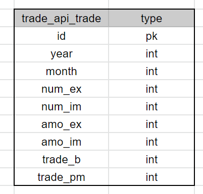
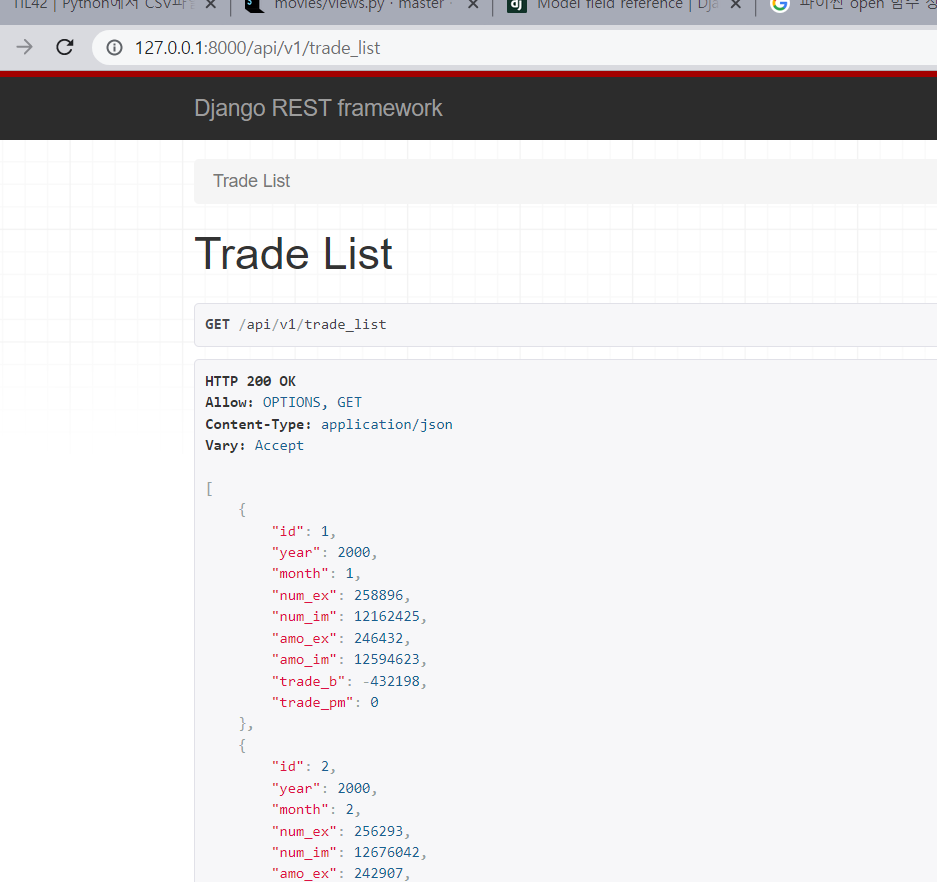

# DETP1 Report

작업 과정을 기록한 보고서 페이지입니다. 

## 0. 목차

1. 데이터 전처리

   ✅데이터 source

   ✅데이터 전처리

2. API 구성과정

   ✅django 환경구축

   ✅ERD

   ✅csv => DB

   ✅REST API로 보내기

3. 대시보드 구성

   ⬜

   ⬜ 

## 1. 데이터 전처리

이번 프로젝트는 batch process는 생략하였습니다. 

1. 데이터 source 구하기: [수출입 무역통계](https://unipass.customs.go.kr/ets/index.do) 에서 데이터를 받아왔습니다. 
   - 수출입총괄 (2000.01 ~ 2022.05) (단위 : 천 불)
     - 수출건수 
     - 수입건수
     - 수출금액
     - 수입금액
     - 무역수지 (수입 - 수출 값)
   - 기본데이터로 계산해서 새로운 컬럼을 생성
     - 적자/흑자여부 (bool)
   - 추가로 구현해보고 싶은 것 (이거는 이후에 하자)
     - 수출이 가장 높은 달
     - 수입이 가장 높은 달

 

2. 데이터 전처리하기

   xls 파일을 csv로 바꾸고 바로  django model에 넣으려고 함

   1. 컬럼명 변경 (exel에서 작업)

      | 수출건수 | num_ex  |
      | -------- | ------- |
      | 수입건수 | num_im  |
      | 수출금액 | amo_ex  |
      | 수입금액 | amo_im  |
      | 무역수지 | trade_b |

   2. "기간" 컬럼 => `연 / 월` 나누기

   완성 데이터:

   

​		이 데이터를 이제 csv 형식으로 바꿀 예정

## 2. API 구성과정

1. django 환경 만들기

   project명 : server

   app 명 : trade_api 

   app 만들고 settings.py에 등록

   rest framework 가져와서 역시 settings.py에 등록

2. ERD

   

   +) trade_pm은 무역수지가 음수면 0, 양수면 1으로 기입하였음

3. csv를 DB에 담기

   [이 블로그를 참고함](https://jeleedev.tistory.com/152)

4. REST API로 내보내기

   

잘 나왔음
